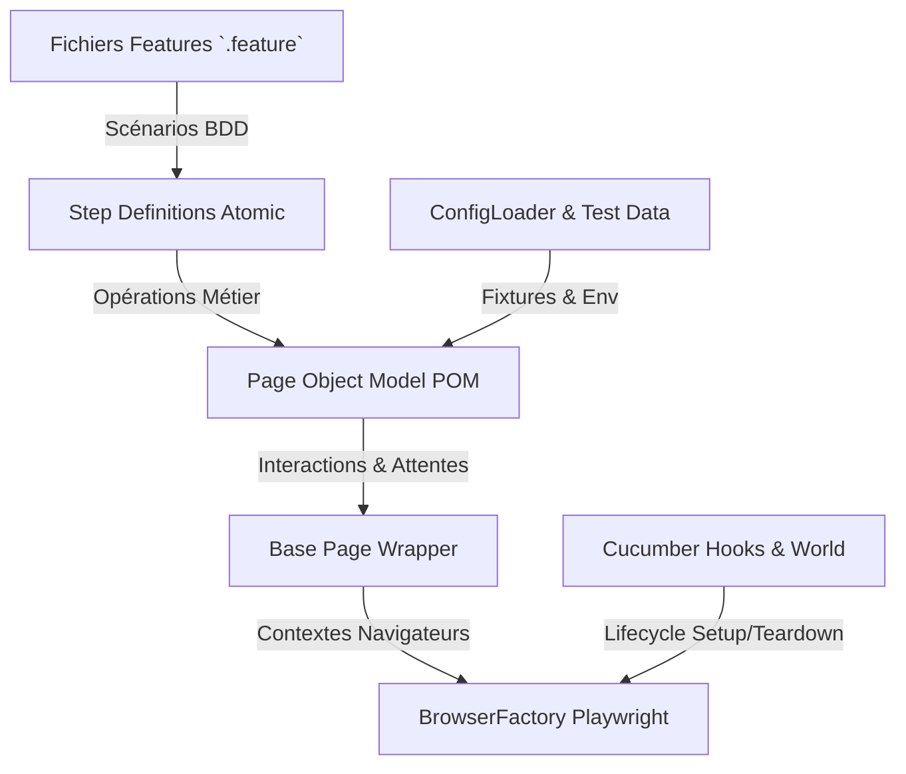

# 🛍️ H&M E2E Automation Testing Framework (Playwright + TypeScript + Cucumber BDD)

Ce projet est un framework d'automatisation de tests End-to-End (E2E) modulaire, maintenable et évolutif conçu pour valider les parcours utilisateurs clés sur le site e-commerce **[H&M (https://www2.hm.com/)](https://www2.hm.com/)**.

Il a été développé en conformité stricte avec le guide d'architecture **BDD / Playwright / TypeScript / Page Object Model (POM)**.

---

## 🎯 Objectifs & Scénarios Automatisés

Le framework couvre les 6 cas d'usage fonctionnels demandés :

1. **Choix du Pays / Région** : Navigation vers le sélecteur de localisation et validation de la redirection vers le marché France (`fr_fr`).
2. **Inscription (Sign Up)** : Complétion dynamique du formulaire de création de compte avec identifiants uniques et vérification du traitement de la soumission.
3. **Déconnexion (Log Out)** : Fermeture sécurisée de la session utilisateur et redirection vers la page de connexion/accueil.
4. **Recherche de produit** : Recherche ciblée de la *"Chemise Relaxed Fit en coton"* et vérification de la présence des résultats.
5. **Ajout au panier** : Sélection de la taille **M** et ajout de la *"Chemise Relaxed Fit en coton"* au panier d'achat.
6. **Ajout aux favoris** : Recherche et ajout d'un article complémentaire à la liste d'envies (favoris).

---

## 🏗️ Architecture & Choix Techniques

### 1. Stack Technique
- **Playwright (`@playwright/test`)** : Choisi pour sa rapidité d'exécution, son support natif multi-navigateurs (Chromium, Firefox, WebKit), son mécanisme d'attente automatique (*auto-waiting*) et sa résilience face aux éléments dynamiques.
- **TypeScript (`^5.6.0`)** : Apporte le typage statique, l'autocomplétion avancée et la prévention des erreurs à la compilation.
- **Cucumber BDD (`@cucumber/cucumber`)** : Permet une rédaction des scénarios de test en langage naturel (Gherkin en français) lisible par les équipes métiers, produit et QA.
- **Winston** : Journalisation structurée des étapes de test dans la console et dans des fichiers de logs dédiés.
- **Dotenv** : Gestion découplée des configurations multi-environnements (`.env`, `.env.test`).

### 2. Principes de Conception (Pillars)


- **Découplage strict** : Aucune assertion ni aucun sélecteur CSS/XPath n'est présent dans les *Step Definitions*. Les sélecteurs et la logique d'interaction sont encapsulés à 100% dans les *Page Objects*.
- **Gestion résiliente des bannières (Cookie Banner)** : Le composant `CookieBannerComponent` intercepte et accepte automatiquement les overlays OneTrust/Cookies lors de l'accès au site.
- **Isolation des contextes** : Chaque scénario s'exécute dans un contexte de navigateur Playwright vierge pour garantir l'indépendance des tests.

---

## 📁 Structure du Projet

```text
HM-Testing-/
├── .env                         # Variables d'environnement par défaut
├── .env.test                    # Configuration spécifique à l'environnement de test
├── cucumber.cjs                 # Configuration du runner CucumberJS
├── tsconfig.json                # Configuration du compilateur TypeScript
├── package.json                 # Dépendances et scripts d'exécution
├── README.md                    # Documentation du projet
├── test-data/                   # Données de test & fixtures JSON
│   └── hm/
│       └── data.json
├── src/
│   ├── config/                  # Chargeur de configuration typé
│   │   ├── EnvironmentConfig.ts
│   │   └── ConfigLoader.ts
│   ├── core/                    # Abstractions de bas niveau
│   │   ├── BasePage.ts          # Encapsulation des clics, saisies et attentes
│   │   └── BrowserFactory.ts    # Gestionnaire de navigateur Playwright
│   ├── hooks/                   # Cycle de vie Cucumber
│   │   ├── CustomWorld.ts       # Définition du contexte World
│   │   └── CucumberHooks.ts     # Hooks Before, After (Capture d'écran d'échec)
│   ├── pages/                   # Page Object Model (POM)
│   │   ├── components/
│   │   │   ├── CookieBannerComponent.ts
│   │   │   └── HeaderComponent.ts
│   │   └── hm/
│   │       ├── CountrySelectionPage.ts
│   │       ├── AuthPage.ts
│   │       ├── ProductSearchPage.ts
│   │       ├── ProductDetailsPage.ts
│   │       ├── CartPage.ts
│   │       └── FavoritesPage.ts
│   ├── tests/
│   │   ├── features/            # Scénarios Gherkin (.feature)
│   │   │   └── hm/
│   │   │       ├── 01_country_selection.feature
│   │   │       ├── 02_authentication.feature
│   │   │       ├── 03_product_search_cart.feature
│   │   │       └── 04_favorites.feature
│   │   └── step-definitions/    # Implémentation des étapes TypeScript
│   │       └── hm/
│   │           ├── country_selection.steps.ts
│   │           ├── authentication.steps.ts
│   │           ├── product_search_cart.steps.ts
│   │           └── favorites.steps.ts
│   └── utils/                   # Utilitaires (Logger, TestDataHelper)
│       ├── Logger.ts
│       └── TestDataHelper.ts
└── outputs/                     # Artefacts générés
    ├── reports/                 # Rapports HTML et JSON Cucumber
    ├── screenshots/             # Captures d'écran en cas d'échec
    └── logs/                    # Fichiers de logs Winston
```

---

## 🚀 Procédure d'Installation et d'Exécution

### 1. Prérequis
- **Node.js** (version 18+ recommandée)
- **npm** (inclus avec Node.js)

### 2. Installation des dépendances
```bash
# Cloner le dépôt
git clone <URL_DU_REPO_GIT>
cd HM-Testing-

# Installer les packages npm
npm install

# Installer les navigateurs Playwright
npx playwright install chromium
```

### 3. Exécution des Tests

#### ▶️ Exécution Headless (Mode par défaut)
```bash
npm test
```

#### 🖥️ Exécution Headed (Navigateur visible en mode ralenti)
```bash
npm run test:headed
```

#### 🎯 Exécution ciblée par fonctionnalité (Par Tags)
```bash
# Sélection de Pays (Headless / Headed)
npm run test:country
npm run test:country:headed

# Authentification (Inscription & Déconnexion)
npm run test:auth

# Recherche Produit & Panier
npm run test:cart

# Favoris
npm run test:favorites
```

#### 📊 Exécution et Génération du Rapport HTML
```bash
npm run test:report
```
Le rapport interactif sera généré sous : `outputs/reports/cucumber-report.html`.

#### 🔍 Vérification du typage TypeScript
```bash
npm run build
```

---

## 🛡️ Note d'Environnement & Pare-feu H&M (Akamai WAF)

Le site d'évaluation **[https://www2.hm.com/](https://www2.hm.com/)** est un environnement e-commerce réel de production protégé par le pare-feu réseau **Akamai Bot Manager (EdgeSuite)**. 

- **Détection des requêtes automatisées** : En cas de requêtes automatisées répétées ou rapides provenant d'une même adresse IP, le pare-feu H&M intercepte la session et renvoie sa page d'erreur système *"It's not you, it's us!"* ou *"Access Denied"*.
- **Gestion dans le Framework** : Le framework est conçu avec des vérifications d'assertions strictes sur le contenu réel (`expect(hasErrorPage).toBeFalsy()`) afin d'intercepter immédiatement tout blocage WAF et d'éviter les faux positifs. Pour tester sans restriction IP, privilégier des exécutions ciblées par tags (`npm run test:country:headed`) ou renouveler l'adresse IP cliente.

---

## 💡 Choix Fonctionnels & Stratégie de Test

1. **Simplicité et clarté Gherkin** : Les étapes Gherkin sont écrites en Français fonctionnel pur, compréhensible par un membre non technique.
2. **Génération dynamique des emails de test** : Pour éviter les collisions d'inscription lors d'exécutions répétées, le `TestDataHelper` génère automatiquement un email unique horodaté (`qa.test.hm.<timestamp>@test-hm-auto.com`).
3. **Capture d'écran automatique sur échec** : Le hook `After` intercepte tout échec de scénario et attache immédiatement une capture d'écran `PNG` pleine page au rapport Cucumber HTML.
4. **Logs détaillés** : Chaque interaction UI (clic, saisie, attente) est loggée via `Winston` avec un horodatage précis dans `outputs/logs/execution.log`.